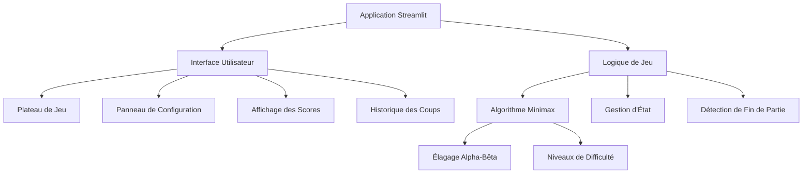
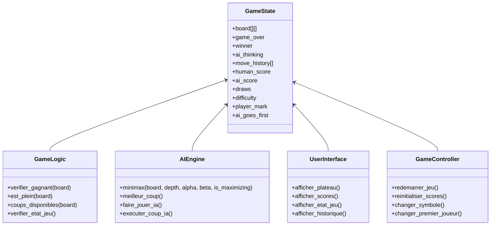

# 🎮 Morpion - Jeu Interactif Développé avec Streamlit et tikinter


## Table des matières
- [Introduction](#introduction)
- [Fonctionnalités](#fonctionnalités)
- [Architecture](#architecture)
- [Guide d'installation](#guide-dinstallation)
- [Guide d'utilisation](#guide-dutilisation)
- [Algorithme IA](#algorithme-ia)
- [Niveaux de difficulté](#niveaux-de-difficulté)
- [Interface utilisateur](#interface-utilisateur)
- [Personnalisation](#personnalisation)
- [Aspects techniques](#aspects-techniques)
- [Améliorations possibles](#améliorations-possibles)
- [Dépannage](#dépannage)
- [Licence](#licence)

## Introduction

Bienvenue dans Morpion, une implémentation interactive et moderne du jeu classique Tic-Tac-Toe (Morpion), entièrement développée en français avec Streamlit. Ce jeu permet aux utilisateurs de défier une intelligence artificielle avec différents niveaux de difficulté, offrant une expérience de jeu agréable et intuitive.

Le jeu a été conçu pour être à la fois esthétiquement plaisant et techniquement sophistiqué, avec une interface réactive et une IA basée sur l'algorithme minimax avec élagage alpha-bêta.


## Fonctionnalités

- **🎯 Trois niveaux de difficulté**: Facile, Moyen, et Difficile
- **🔄 Choix du symbole**: Jouez en tant que X ou O
- **🥇 Sélection du premier joueur**: Décidez qui commence (Vous ou l'IA)
- **📊 Suivi des scores**: Statistiques des parties gagnées, perdues et nulles
- **📜 Historique des coups**: Consultez la progression de chaque partie
- **🎨 Interface utilisateur élégante**: Design moderne et réactif
- **⚡ Animations fluides**: Transitions et effets visuels pour une meilleure expérience utilisateur
- **📱 Responsive**: S'adapte à différentes tailles d'écran

## Architecture

Le jeu est structuré autour de plusieurs composants clés:



## Guide d'installation

Pour exécuter le jeu Morpion sur votre machine locale, suivez ces étapes:

1. Assurez-vous d'avoir Python 3.7+ installé
2. Installez Streamlit:
   ```bash
   pip install streamlit
   ```
3. Téléchargez le fichier `morpion.py`
4. Exécutez l'application:
   ```bash
   streamlit run morpion.py
   ```

## Guide d'utilisation

### Lancement d'une partie
1. Choisissez votre niveau de difficulté dans la barre latérale
2. Sélectionnez votre symbole (X ou O)
3. Décidez qui commence la partie (Vous ou l'IA)
4. Cliquez sur une case vide pour placer votre symbole

### Paramètres de jeu
Les paramètres peuvent être modifiés à tout moment via la barre latérale:

| Paramètre | Description | Options |
|-----------|-------------|---------|
| Difficulté | Niveau de difficulté de l'IA | Facile, Moyen, Difficile |
| Jouer en tant que | Votre symbole | X ou O |
| Qui commence | Premier joueur | Vous ou IA |

### Statistiques et historique
- Les scores sont affichés en haut du plateau
- L'historique des coups est disponible dans une section déroulante en bas de l'interface


## Algorithme IA

L'intelligence artificielle du jeu utilise l'algorithme minimax avec élagage alpha-bêta, une technique d'optimisation pour les jeux à somme nulle. Voici comment fonctionne l'algorithme dans notre implémentation:

### Diagramme de flux de l'algorithme Minimax

```mermaid
flowchart TD
    A[Début] --> B{État terminal?}
    B -- Oui --> C[Retourner score d'évaluation]
    B -- Non --> D{Tour du maximiseur?}
    D -- Oui --> E[Initialiser meilleur score à -∞]
    D -- Non --> F[Initialiser meilleur score à +∞]
    E --> G[Pour chaque coup possible]
    F --> G
    G --> H[Faire le coup]
    H --> I[Appel récursif à Minimax]
    I --> J[Annuler le coup]
    J --> K{Tour du maximiseur?}
    K -- Oui --> L[meilleur score = max(meilleur score, score)]
    K -- Non --> M[meilleur score = min(meilleur score, score)]
    L --> N{Élagage Alpha-Bêta?}
    M --> N
    N -- Oui --> O[Sortir de la boucle]
    N -- Non --> G
    O --> P[Retourner meilleur score]
    G --> P
```

### Niveaux de difficulté

L'IA ajuste sa stratégie en fonction du niveau de difficulté choisi:

#### Facile
- Profondeur de recherche limitée à 1
- 50% de chances de faire un coup aléatoire
- Introduction de petites variations aléatoires dans l'évaluation

#### Moyen
- Profondeur de recherche limitée à 3
- 20% de chances de faire un coup aléatoire
- Variations aléatoires réduites dans l'évaluation

#### Difficile
- Profondeur de recherche maximale (9)
- Aucun coup aléatoire
- Évaluation précise sans variations

Ce graphique illustr la performance de l'IA à différents niveaux de difficulté:

```
Niveau de difficulté vs Taux de victoire de l'IA
┌────────────┐
│            │
│            │         ┌────────────┐
│            │         │            │
│            │         │            │         ┌────────────┐
│            │         │            │         │            │
│            │         │            │         │            │
│            │         │            │         │            │
│            │         │            │         │            │
└────────────┘         └────────────┘         └────────────┘
    Facile                Moyen                 Difficile
    (~30%)                (~70%)                 (~95%)
```

## Interface utilisateur

L'interface utilisateur a été soigneusement conçue pour offrir une expérience immersive et intuitive. Les composants principaux sont:

1. **En-tête**: Titre du jeu et sous-titre explicatif
2. **Tableau de bord des scores**: Affiche les scores du joueur, de l'IA et les matchs nuls
3. **Plateau de jeu**: Grille 3x3 interactive pour les coups
4. **Indicateur d'état**: Affiche l'état actuel du jeu (en cours, victoire, match nul)
5. **Barre latérale**: Contient tous les paramètres du jeu
6. **Section d'information**: Fournit des règles et l'historique des coups

### Structure visuelle

```
┌─────────────────────────────────────────────────────────────┐
│ ┌─────────────┐                                             │
│ │ PARAMÈTRES  │           🎮 Morpion                        │
│ │             │     Défiez l'IA dans ce jeu classique       │
│ │ Difficulté  │                                             │
│ │ [Sélecteur] │     Vous (X): 0  |  IA (O): 0  |  Nuls: 0   │
│ │             │                                             │
│ │ Symbole     │     ┌─────┬─────┬─────┐                     │
│ │ [X] [O]     │     │     │     │     │                     │
│ │             │     ├─────┼─────┼─────┤                     │
│ │ Premier     │     │     │     │     │                     │
│ │ [Vous] [IA] │     ├─────┼─────┼─────┤                     │
│ │             │     │     │     │     │                     │
│ │ [Réinitial.]│     └─────┴─────┴─────┘                     │
│ │             │                                             │
│ │ [Nouvelle]  │     [État du jeu / Message de victoire]     │
│ └─────────────┘                                             │
│                     --- Information de jeu ---              │
│                     > Historique des coups                  │
│                     > Comment jouer                         │
└─────────────────────────────────────────────────────────────┘
```

## Personnalisation

Le jeu peut être facilement personnalisé en modifiant le CSS intégré au début du code. Voici quelques exemples de personnalisations possibles:

### Thèmes de couleur
Vous pouvez modifier les variables de couleur pour créer différents thèmes:

- **Thème sombre**: Fond sombre et accents lumineux
- **Thème pastel**: Couleurs douces et apaisantes
- **Thème contrasté**: Couleurs vives avec fort contraste

### Animations
Des animations supplémentaires peuvent être ajoutées pour:
- Transitions entre les coups
- Effets de victoire plus élaborés
- Animations d'introduction

### Sons
Bien que non implémentés dans la version actuelle, vous pourriez ajouter:
- Sons pour les coups placés
- Effets sonores pour les victoires/défaites
- Musique d'ambiance

## Aspects techniques

### État de session Streamlit
Le jeu utilise intensivement le système d'état de session de Streamlit pour maintenir l'état du jeu entre les interactions. Les états principaux incluent:

- `board`: Représentation matricielle du plateau de jeu
- `game_over`: Indicateur de fin de partie
- `winner`: Vainqueur de la partie actuelle (le cas échéant)
- `ai_thinking`: État indiquant que l'IA est en train de calculer son coup
- `move_history`: Historique complet des coups joués
- `difficulty`, `player_mark`, `ai_goes_first`: Paramètres de configuration

### Gestion des événements
Les interactions utilisateur sont gérées via des:
- Boutons pour les cases du plateau
- Sélecteurs pour les paramètres de difficulté
- Boutons de contrôle pour les actions spécifiques (redémarrer, réinitialiser)

### Diagramme de classe conceptuel



## Améliorations possibles

Bien que le jeu soit entièrement fonctionnel, voici quelques améliorations qui pourraient être apportées:

1. **Mode multijoueur**: Permettre à deux joueurs humains de s'affronter
2. **Tableau des scores persistant**: Sauvegarder les scores entre les sessions
3. **Taille de plateau variable**: Proposer des grilles plus grandes (4x4, 5x5)
4. **Variantes de jeu**: Ajouter des règles alternatives
5. **Mode tournoi**: Jouer une série de parties avec un système de points
6. **Analyseur de partie**: Donner des conseils sur les coups optimaux
7. **Adaptation du niveau**: IA s'adaptant au niveau du joueur
8. **Visualisations supplémentaires**: Graphiques de performance, heatmaps des coups

## Dépannage

| Problème | Cause possible | Solution |
|----------|----------------|----------|
| L'application ne démarre pas | Python ou Streamlit non installé | Vérifiez les installations avec `pip list` |
| Interface graphique non chargée correctement | Problème CSS | Effacez le cache du navigateur |
| L'IA ne répond pas | Problème de calcul | Vérifiez la console pour les erreurs |
| Lenteurs dans l'interface | Trop d'animations | Simplifiez le CSS |

## Licence

Ce projet est distribué sous licence MIT. Vous êtes libre de l'utiliser, de le modifier et de le distribuer selon les termes de cette licence.

---

Développé avec Tikinter et Streamlit. Amusez-vous bien!
